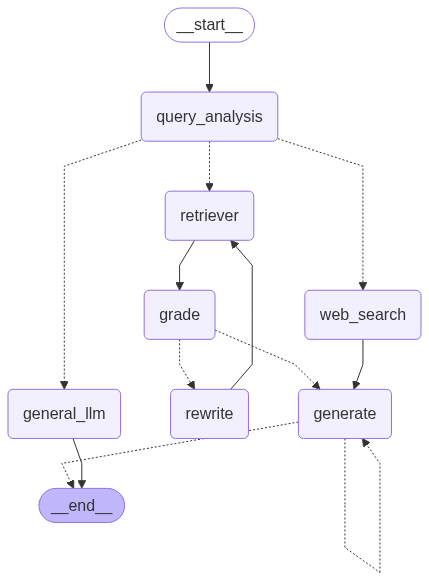

# AgenticRAG 🚀

Adaptive Agentic RAG System using LangGraph, Qdrant, FastAPI, Streamlit, and Groq LLMs.


---

# 📌 Overview

**AgenticRAG** is an intelligent Retrieval-Augmented Generation (RAG) system that combines:

- Adaptive query routing
- Multi-agent workflows
- Vector search retrieval
- Document understanding
- Conversational memory
- Real-time AI responses

The project uses:

- **LangGraph** for workflow orchestration
- **Qdrant** for vector storage
- **FastAPI** as backend APIs
- **Streamlit** for frontend UI
- **Groq LLMs** for ultra-fast inference

Users can upload documents, ask questions, and receive context-aware AI-generated responses powered by Groq.

---

# ✨ Features

## 🧠 Adaptive Query Routing
Automatically routes queries to:
- Document Retrieval
- General LLM Response
- Web Search

---

## 📄 Document Upload & Processing
- Upload PDF and TXT files
- Automatic chunking
- Embedding generation
- Vector indexing using Qdrant

---

## 🔍 Intelligent Retrieval
- Semantic similarity search
- Relevance grading
- Query rewriting
- Context-aware generation

---

## 🤖 Agentic AI Workflow
Built using LangGraph nodes:
- Query Analysis
- Routing
- Retrieval
- Grading
- Response Generation

---

## 💬 Conversational Memory
- MongoDB/In-memory history
- Session-based conversations
- Context retention

---

## 🌐 Streamlit Frontend
- Interactive chatbot UI
- Real-time responses
- Document upload support

---

# 🏗️ Tech Stack

| Technology | Purpose |
|---|---|
| Python | Backend Language |
| LangChain | LLM Framework |
| LangGraph | Agentic Workflow |
| FastAPI | Backend APIs |
| Streamlit | Frontend UI |
| Qdrant | Vector Database |
| MongoDB | Chat Memory |
| Groq | LLM Provider |
| Tavily | Web Search |

---

# 📂 Project Structure

```bash
AgenticRAG/
│
├── src/
│   ├── api/
│   ├── config/
│   ├── core/
│   ├── db/
│   ├── llms/
│   ├── memory/
│   ├── models/
│   ├── rag/
│   └── tools/
│
├── streamlit_app/
│   ├── pages/
│   └── utils/
│
├── app.py
├── requirements.txt
├── README.md
├── .env.example
└── .gitignore
```

---

# ⚙️ Installation

## 1️⃣ Clone Repository

```bash
git clone https://github.com/Ishant713/AgenticRAG.git
cd AgenticRAG
```

---

## 2️⃣ Create Virtual Environment

```bash
python -m venv venv
```

### Windows

```bash
venv\Scripts\activate
```

### Linux / Mac

```bash
source venv/bin/activate
```

---

## 3️⃣ Install Dependencies

```bash
pip install -r requirements.txt
```

---

# 🔑 Environment Variables

Create a `.env` file in the root directory.

Example:

```env
GROQ_API_KEY=your_groq_api_key

QDRANT_URL=your_qdrant_url
QDRANT_API_KEY=your_qdrant_key

MONGODB_URL=your_mongodb_url

TAVILY_API_KEY=your_tavily_api_key
```

---
## Results 
### Genral LLm answer without uploading Document file 


 ### Giving Answer using RAG
 

### Giving answer using general LLM instead from RAG


### Using(TAVILY) for Web search for getting answer


# ▶️ Running the Project

## Start FastAPI Backend

```bash
uvicorn src.main:app --reload
```

Backend URL:

```bash
http://localhost:8000
```

---

## Start Streamlit Frontend

```bash
streamlit run streamlit_app/home.py
```

Frontend URL:

```bash
http://localhost:8501
```

---

# 📡 API Endpoints

## Query Endpoint

```http
POST /rag/query
```

### Example Request

```json
{
  "query": "What is Retrieval-Augmented Generation?",
  "session_id": "user_1"
}
```

---

## Document Upload Endpoint

```http
POST /rag/documents/upload
```

### Supported Formats
- PDF
- TXT

---

# 🧪 Example Workflow

1. Upload documents
2. Documents are chunked & embedded
3. Stored inside Qdrant
4. Ask questions
5. LangGraph routes query
6. Groq LLM generates contextual response

---

# 🚀 Future Improvements

- Multi-user authentication
- Hybrid search
- Better memory optimization
- Cloud deployment
- Multi-modal support
- Analytics dashboard

---

# 📸 Project Preview

```md

```

---

# 🌟 Why This Project?

This project demonstrates:
- Agentic AI systems
- RAG pipelines
- LangGraph orchestration
- Vector databases
- FastAPI backend development
- Streamlit integration
- LLM application development

Perfect for:
- AI/ML portfolios
- Resume projects
- Internship applications
- Open-source showcase

---

# 👨‍💻 Author

## Ishan Dhakad

- GitHub: https://github.com/Ishant713

---

# 📄 License

This project is licensed under the MIT License.

---

# ⭐ Support

If you found this project useful, consider giving it a ⭐ on GitHub.
